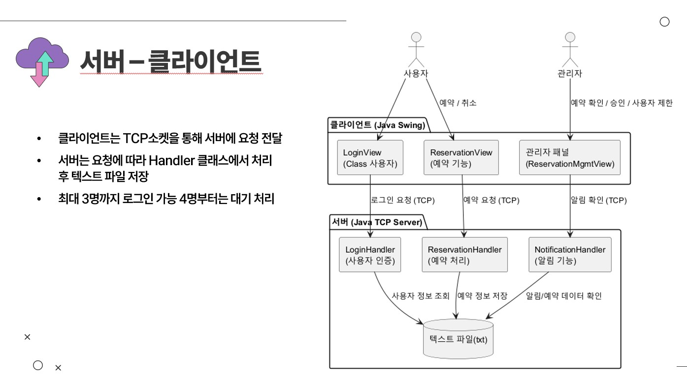

# 🖥️ Java Socket 기반 교실 예약 & 파일 동기화 시스템

> **외부IP연결 → 로그인/회원가입 → 규칙 동의 → 사용자/관리자 예약 관리 → 알림/통계** 까지 한 번에 제공하는  
> **Java Swing + Socket** 프로젝트입니다. 파일 변경은 서버를 통해 **실시간 동기화**되며,  
> 동시 접속은 **3명 제한 + 대기열(FIFO)** 로 관리됩니다.

[]()
[]()
[]()
[](#-license)

---

## ✨ 주요 기능 (Overview)

1) **인증 & 연결**
- 서버 IP/PORT 입력 후 연결
- 회원가입 및 로그인
- 사용자 유형(관리자/교수,학생)별 진입점 제공

2) **규칙 동의 & 관리**
- 로그인 직후 약관/규칙 동의 화면
- 관리자가 규칙 항목 등록·수정 가능

3) **예약 시스템 (사용자 + 관리자)**
- 사용자: 교실/시간 선택, 예약 생성/조회/취소, 알림
- 관리자: 예약 전체 현황 관리(검색/수정/삭제), <BR>예약 승인 및 거절기능,
          강의실 정보 수정기능,  예약 시각화, 공지사항 수정,
          일부 계정 예약 제한기능, 예약 취소관리(취소사유등)
- 달력/다이얼로그 기반 UI 제공

4) **파일 동기화 & 세션 관리**
- 파일 변경 감지 → 서버 반영 → 다른 클라이언트에 실시간 전파
- 동시 접속 3명 제한, 초과 시 대기열(FIFO) 관리
- 종료 시 세션 정리 후 대기자 자동 입장

<p align="center">
  
</p>
---

## 📸 실행 화면

### 👤 사용자 기능 (User)

| 로그인 화면 | 예약 화면 |
|-------------|-----------|
|   |  |
| 로그인 화면 |
|   | 
---

### 🛠 관리자 기능 (Admin)

| 대시보드 | 예약 관리 | 강의실 관리 |
|----------|-----------|-------------|
|  |  |  |

| 통계 화면 | 공지사항 관리 | 예약 제한 |
|-----------|--------------|-----------|
|  |  |  |

| 엑셀 연동 |   |   |
|-----------|---|---|
|  |   |   |

---

### 📂 프로젝트 관리 시각화
<p align="center">
  
</p>

---

### 🎬 세션 관리 데모 (GIF)
<p align="center">
  
</p>

---
## 🧱 모듈 구조 (주요 클래스 맵)

### 1) 인증 & 연결
- `Main` (프로그램 시작)
- `ConnectView` (서버 IP/포트 입력 화면)
- `LoginController`, `LoginModel`, `LoginService`, `LoginView`
- `SignupController`, `SignupModel`, `SignupView`

### 2) 규칙(약관) 동의/관리 (MVC)
- `RuleAgreementController`, `RuleAgreementModel`, `RuleAgreementView`
- `RuleManagementController`, `RuleManagementModel`, `RuleManagementView`

### 3) 예약 시스템 (MVC)
- 공용/UI
  - `UserMainController`, `UserMainModel`, `UserMainView` (사용자 대시보드)
  - `ReservationController`, `ReservationModel` (핵심 로직)
  - `ReservationGUIController`, `ReservationView`, `ConsoleView`
  - `MainView`, `DetailView` (예약 목록/상세)
  - 달력 & 선택 다이얼로그:  
    `CalendarController`, `CalendarView`, `DialogController`,  
    `RoomTypeDialogView`, `RoomNumberDialogView`, `TimeSlotDialogView`, `BlockTypeDialogView`
- 사용자 기능
  - `UserReservationListController`, `UserReservationModel`, `UserReservationListView`
  - `UserReservationCancelController`, `UserReservationCancelModel`, `UserReservationCancelView`
  - `UserNoticeController`, `UserNoticeModel`, `UserNoticeView` (알림)
  - `UserStatsController`, `UserStatsModel`, `UserStatsView` (통계)
  - `CheckinDialog` (체크인/확인 다이얼로그)
- 관리자 기능
  - `ReservationMgmtController`, `ReservationMgmtModel`, `ReservationMgmtDataModel`, `ReservationMgmtView`
  - 교실 관리: `ClassroomController`, `ClassroomModel`, `ClassroomView`, `RoomModel`
  - (옵션) 엑셀 로드: `ExcelLoader` ※ `.xlsx` 사용 시 Apache POI 필요 가능

### 4) 동기화 & 세션
- `FileSyncClient`, `FileWatcher`, `SocketManager`, `LogoutUtil`
- 알림 UI 버튼: `NotificationButton`
- 알림 MVC: `NotificationController`, `NotificationModel`, `NotificationView`

---

## 🧭 사용자 플로우

1. **서버 연결**: `ConnectView`에서 IP/PORT 입력 → 연결  
2. **로그인/회원가입**: `LoginView / SignupView`에서 진행  
3. **규칙 동의**: `RuleAgreementView` 체크 완료 → 사용자 메인(`UserMainView`)  
4. **예약**: 달력/다이얼로그로 조건 선택 → 생성/조회/수정/취소  
5. **알림/통계**: 변경 알림 확인, 본인 예약 통계 확인  
6. (관리자) **예약 전체·교실·엑셀 관리**: `ReservationMgmtView`, `ClassroomView` 등

<p align="center">
  
</p>

---

## 🛠 기술 스택

- **Language/UI**: Java 8+ / **Swing** (일부 `.form` → NetBeans GUI Builder 기반)
- **Network**: **TCP Socket** (클라이언트–서버), ACK 기반 동기화
- **Pattern**: **MVC 분리** (Controller ↔ Model ↔ View)
- **Optional**: Excel 연동 시 **Apache POI** (`poi`, `poi-ooxml`)

```text
핵심 설계 포인트
- TCP 소켓 통신
- Per-connection 워커 스레드(서버 측 가정), 이벤트 드리븐 UI(클라이언트)
- 세션 제한(동시 3명) + FIFO 대기열 + 자동 입장
- 파일 동기화(서버 반영 + ACK 전파)
